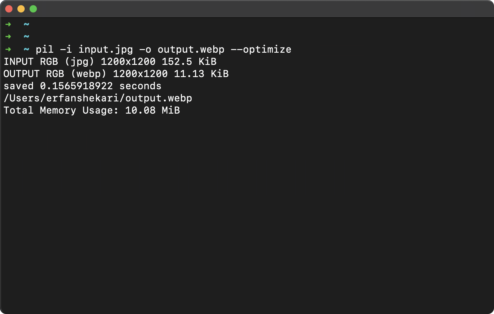

# PIL - Feel power of pillow in cli



PIL is a command-line tool that simplifies image format conversion and manipulation using Python Pillow, a fast and powerful imaging library.

## Features

### Format Conversion

Easily convert images from one format to another. Just specify the input and output formats, and PIL will handle the conversion process.

### Image Optimization

Pillow provides effective image compression, reducing file sizes while preserving visual quality for efficient storage and faster transmission.

### Image Compression

Efficiently reduce image file sizes without compromising quality, allowing for optimized storage and speedy file transfers.

### Resizing Images

Resize images to specific dimensions or aspect ratios with high-quality results and no loss of image details.

### Square Images

PIL can convert images into square shapes for uniform and visually appealing presentations, commonly used for social media profiles, galleries, and applications requiring consistent appearance.

## Supported Platforms

- Linux
- macOS

## Installation

Ensure you have Python 3.8+, pip3, and venv installed before proceeding.

To install PIL CLI, clone this repository and run the installation script:

```bash
git clone https://github.com/erfanshekari/pil.git
cd pil
sudo sh install.sh
```

## Usage

Use the --help flag to view available options and commands:

```bash
pil --help
```

```
usage: pil [...Options] -i INPUT -o OUTPUT

edit images on cmd, powerd by pillow and python

options:
  -h, --help            show this help message and exit
  --input INPUT, -i INPUT
                        The input image can be a Unix path or url
  --actions ACTIONS, -a ACTIONS
                        Chain of actions
  --output OUTPUT, -o OUTPUT
                        The output path to save the image will be the current directory by default
  --overwrite           Overwrite an existing file
  --quality QUALITY, -q QUALITY
                        Spacify image quality
  --optimize, -O        Optimize image
  --verbose, -v         print details of operation
```

Example commands:

Convert png to webp:

```bash
pil -i input_image.png -o output_image.webp
```

Compress image:

```bash
pil -q 90 -O -i input_image.png -o output_image.jpg
```

Resize image while maintaining aspect ratio:

```bash
pil -i input_image.png -a "resize:wx150;" -o output_image.jpg
```

```bash
pil -i input_image.png -a "resize:300xh;" -o output_image.jpg
```

Square image:

```bash
pil -i input_image.png -a "square;" -o output_image.jpg
```

Square and Resize image:

```bash
pil -i input_image.png -a "square;resize:150x150;" -o output_image.jpg
```

## PILProbe

View image details in json using `pilprobe` command.

```bash
pilprobe -i input.webp
```

Output:

```json
{
  "contentType": "image/webp",
  "size": 163904,
  "extension": "webp",
  "name": "input",
  "width": 800,
  "height": 450
}
```

## Contributing

We welcome contributions from the community! If you'd like to contribute to this project, please follow these guidelines:

1. **Fork** the repository on GitHub.
2. Create a **new branch** with a descriptive name for your feature or bug fix.
3. Make your changes and **commit** them, providing a clear and concise commit message.
4. **Push** your changes to your fork.
5. Submit a **pull request** to the main repository's `main` branch.

### Reporting Issues

If you encounter any issues with the project or have suggestions for improvements, please feel free to [open an issue](https://github.com/erfanshekari/pil/issues).

## License

This project is licensed under the [MIT License](LICENSE.md).
